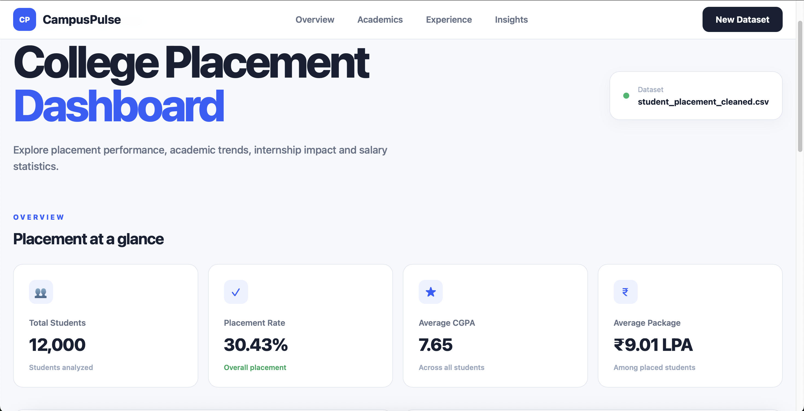
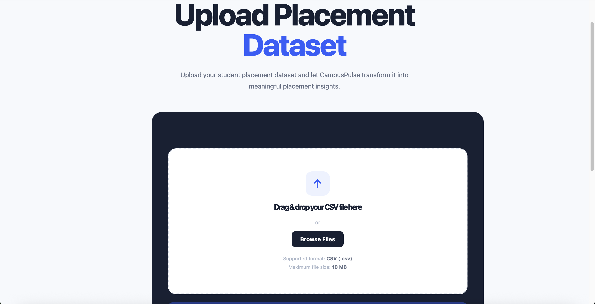
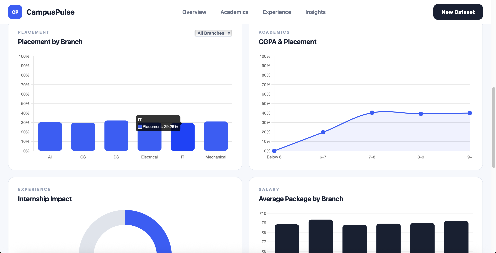

# 📊 CampusPulse

## College Placement Analytics Dashboard

CampusPulse is a web-based data analytics platform that transforms student placement datasets into an interactive dashboard.

Instead of manually analyzing large spreadsheets, users can upload a placement dataset and CampusPulse automatically calculates placement statistics, generates visualizations, and highlights important trends.

---

## 🚀 Live Demo

<p align="center">

<a href="https://campuspulse-rysk.onrender.com">


</a>

</p>

### 👉 Open CampusPulse

https://campuspulse-rysk.onrender.com

---

# 🖥️ Project Preview

## 📊 Dashboard

The main dashboard provides an overview of college placement performance, including placement rate, CGPA, salary packages, branch-wise performance and internship impact.

<p align="center">
  
</p>

---

## 📁 Dataset Upload

Users can upload their placement dataset using the drag-and-drop interface or browse for a CSV file.

<p align="center">
  
</p>

---

## 💡 Automated Insights

CampusPulse converts the analyzed data into easy-to-understand insights about internships, academic performance and branch-level differences.

<p align="center">
  
</p>

---

# 🎯 Problem Statement

College placement data is often maintained in large spreadsheets.

Finding meaningful information from these datasets can require manual calculations and data analysis.

For example:

- What is the overall placement rate?
- Which branch has the highest placement rate?
- Does CGPA affect placement?
- Do internships improve placement outcomes?
- Which branch has the highest average package?
- How many students were analyzed?

CampusPulse automates these calculations and presents the results through an interactive dashboard.

---

# 💡 Solution

CampusPulse follows a simple workflow:

```text
Upload Dataset
      ↓
Validate Dataset
      ↓
Process Data
      ↓
Calculate Statistics
      ↓
Generate Visualizations
      ↓
Display Insights
